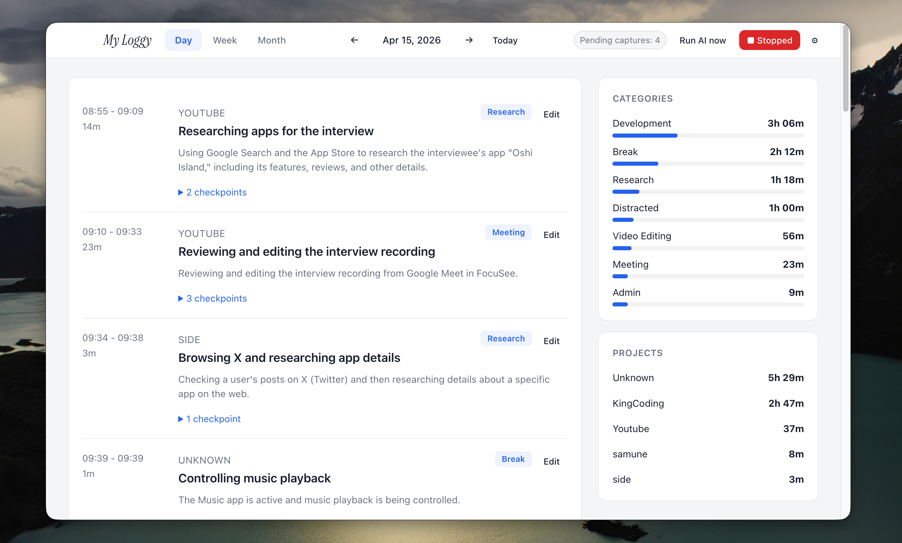
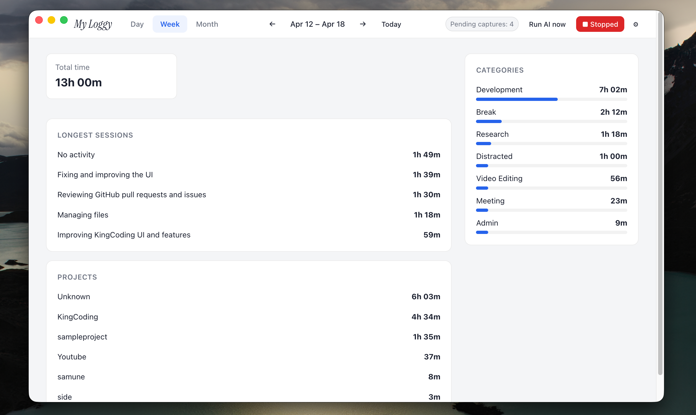
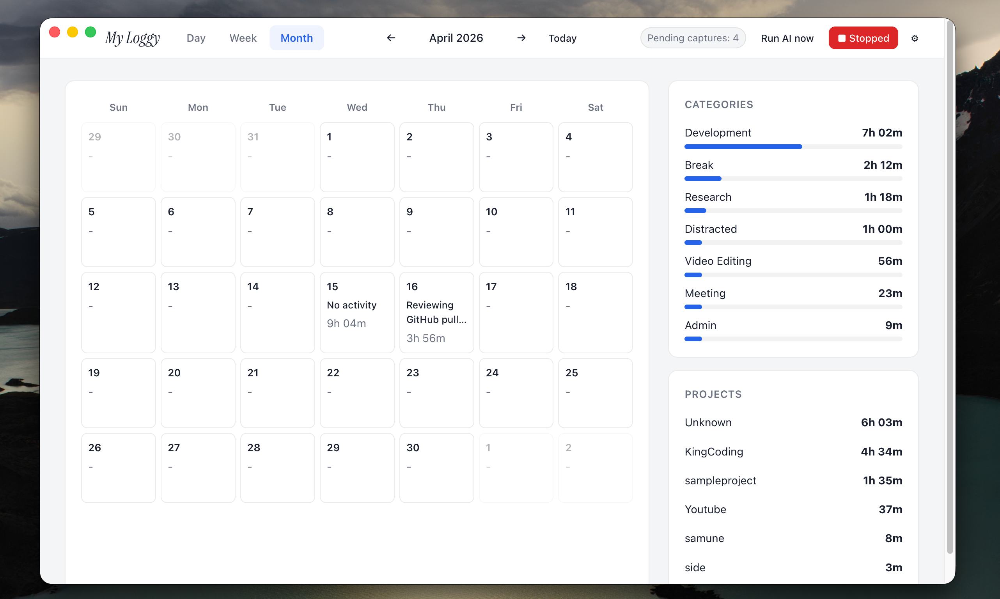

<div align="center">
  
  <h1>myloggy</h1>
  <p><strong>Your work log, captured locally and privately on macOS.</strong></p>
  <p>Screenshots, analysis, summaries, and settings stay on your Mac — nothing leaves your machine.</p>
  <p>
    
    
    
    
  </p>
</div>

## Overview

myloggy is a fully local-first work logging app for macOS.
It quietly captures what you work on, analyzes it with a local LLM, and gives you clean daily, weekly, and monthly views — all without sending your data anywhere.

## Screenshots

<table>
  <tr>
    <td width="33%">
      
    </td>
    <td width="33%">
      
    </td>
    <td width="33%">
      
    </td>
  </tr>
  <tr>
    <td align="center"><strong>Day</strong></td>
    <td align="center"><strong>Week</strong></td>
    <td align="center"><strong>Month</strong></td>
  </tr>
</table>

## Features

- Automatic screenshot capture every minute
- AI checkpoint generation with Ollama
- Daily, weekly, and monthly work log views
- Manual editing of work units
- Configurable exclusion rules and Ollama model
- Local storage with SQLite and files on disk

## Requirements

- macOS
- Node.js `20.19+` or `22.12+`
- [Ollama](https://ollama.com)
- A local model for analysis (example: `ollama pull gemma4:27b`)

`pnpm` is optional. `npm install` and `npm run dev` are enough if your Node.js version meets the requirement.

## Quick start

```bash
git clone https://github.com/iritec/myloggy.git
cd myloggy
npm install
npm run dev
```

If you prefer `pnpm`:

```bash
pnpm install
pnpm dev
```

On first launch, allow **Screen Recording** and **Accessibility** permissions for Electron.

## Download

Prebuilt macOS binaries are available on [GitHub Releases](https://github.com/iritec/myloggy/releases).

## Storage

Data is stored under Electron's `userData` directory.

- `myloggy.sqlite`
- `temp-snaps/`

## Contact

For implementation support, AI transformation consulting, or related inquiries:
[lab.lancers-ai.com](https://lab.lancers-ai.com/)

## License

[MIT](LICENSE)
